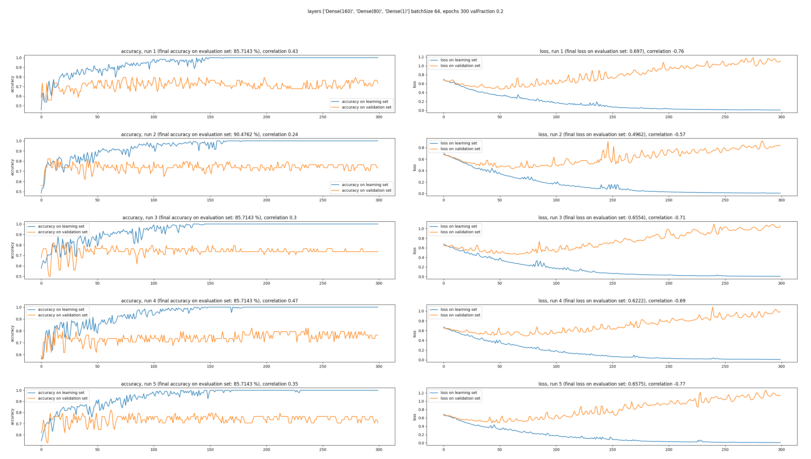
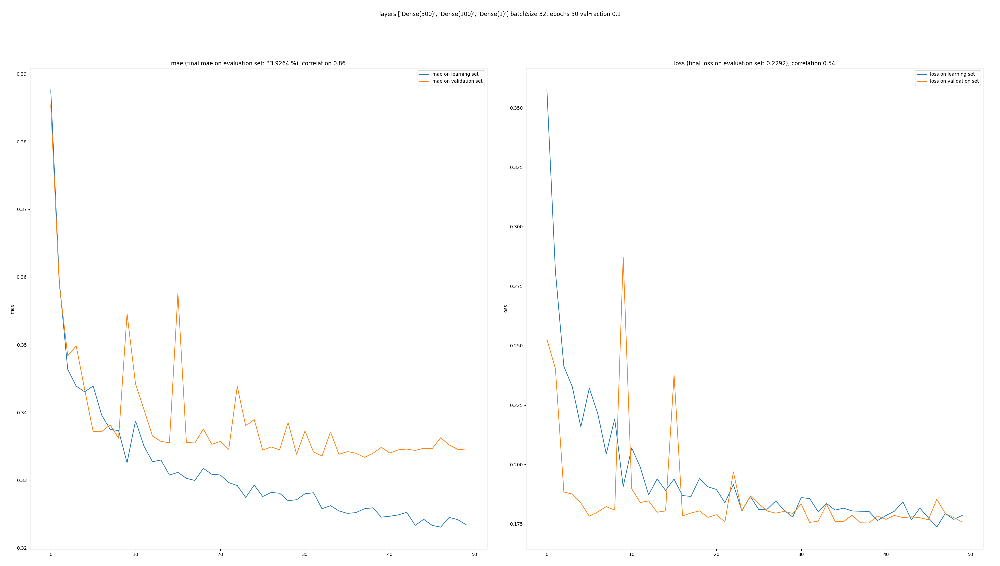

# Fluid NN Builder - neural neworks with fluid style

**Fluid NN Builder** is a lightweight wrapper around the popular **Keras** neural network building library, which allows building and training a neural network by chaining together method calls instead of using a standard procedural approach.

The **Fluid NN Builder** framework is organized around the "fluid" style of programming, largely inspired by the Java's fluid Stream API, as well as similar approaches in other popular libraries.

The motivation for creating such fluid builder was mainly related to my desire to better understand the Keras framework and provide a way to avoid common mistakes, that a beginner user like me might have, by providing a guided way of building and training a neural network.

<br>

## At a glance
Here is an example:

The standard way of building a Keras Neural Network would look something like this:

```python
model = Sequential()
model.add(Dense(300, activation = 'relu', input_shape = x_train.shape[1:]))
model.add(Dense(100, activation = 'relu'))
model.add(Dense(1))
model.compile(optimizer = 'adam', loss = 'mse', metrics = ['mae'])
model.fit(x_train, y_train, epochs = 30, batch_size = 32, validation_split = 0.1)

scores = model.evaluate(x_test, y_test, verbose = 0)
predict = model.predict(x_test)
```

First we construct the network architecture by adding layers, then we provide the compilation parameters to compile the network, and finally we train the network by calling the *fit* method on the newly constructed neural network. Once the network is trained, we evaluate the results on the evaluation set and calculate the predicted result by calling the method *predict*. 

Here is how the same piece of code would look like using the *Fluid NN Builder*

```python
import fluid_nn_builder as fnb

evaluated: fnb.EvaluatedModelResult = fnb.NnArch([
  fnb.layers().Dense().size(300).activation('relu'),
  fnb.layers().Dense().size(100).activation('relu'),
  fnb.layers().Dense().size(1)
]) \
.compilerDef(fnb.createCompilerDef().optimizer('adam').loss('mse').metrics(['mae'])) \
.fitterDef(fnb.createFitterDef().batchSize(32).epochs(30).verbose(True)) \
.trainSet(x_train, y_train).valFraction(0.1).fitModel() \
.evalSet(x_test, y_test).evaluate(verbose = True) \
.ejectResult()

scores = evaluated._scores 
model = evaluated._model
predict = model.predict(x_test)
```

One will clearly identify the same neural network building blocks such as creation, compilation and training.

However, we are clearly separating the definition of the compilation process from the compilation process itself. Likewise, we are applying the same approach for validation, evaluation and fitting.

Each time the idea is to construct the definition of a process, prior to launching the process itself. The definitions that are used for guiding the compilation, training and other phases are stored in special data structures such as CompilerDef and FitterDef. Later we'll see these definitions more in details. 

One may notice that the number of lines of code in these examples wouldn't differ much. 

However, the fluid builder proposes several advantages, such as:

* *Fluid NN Builder* automatically calculates the input shape for the neural network, thus removing the need for one redundant parameter

* *Fluid NN builder* would guide the user by providing only the methods that are applicable for a particular phase. For example, a user wouldn't be able to call training *fit* method before network compilation

* as we'll see later, *Fluid NN Builder* provides a way to easily plot the results of the neural network training process, thus allowing for visual analysis of the training process.

The visual analysis can be in particular helpful for identification of the optimal number of epochs as well as for detecting the so-called "overfitting" problem, when the network "learns by heart" the expected results.

<br>

# Usage

Currently *Fluid NN Builder* exists not as a publicly available Python package, but rather as a single Python file.

So the use of *Fluid NN Builder* would consist of obtaining the file ***fluid_nn_builder.py*** and then importing it. In order to obtain the file one can either check out the repository or simply download the file directly.

Suppose your project is located in the folder **my-project**, and right next to it the **fluid_nn_builder** is being checked out.

So the folder structure looks like this:

> fluid_nn_builider

>> fluid_nn_builder.py

> my-project

>> neural-network-1.py


Then **neural-network-1.py** would use the following lines of code to import the **fluid_nn_builder.py** file:

```python
import os, sys
sys.path.append(os.path.abspath(os.path.join(os.path.dirname( __file__ ), '../fluid_nn_builder')))
import fluid_nn_builder as fnb
```

Since I'm a newbie in Python, unfortunately a more convenient way for now cannot be suggested.
The work in this regard is in progress. 


<br>

# Dependencies

The Fluid NN Builder depends on the following Python modules:

* tensorflow
* sklearn
* matplotlib
* pandas

We assume that these dependencies are already installed. If not, please consult the relevant documentation for installation reference.

<br>

# Fluid NN Builder structure

The users of the Keras framework are familiar with the standard way of NN creation, which roughly consists of constructing the network, compiling it and training the model.

The Fluid NN Builder follows similar approach. 

One can distinguish the following phases which the builder provides:

* constructing the network

```python
fnb.NnArch([
  fnb.layers().Dense().size(300).activation('relu'),
  fnb.layers().Dense().size(100).activation('relu'),
  fnb.layers().Dense().size(1)
])
```

* compiling the network
```python
.compilerDef(fnb.createCompilerDef().optimizer('adam').loss('mse').metrics(['mae'])) \
```

* fitting the network
```python
.fitterDef(fnb.createFitterDef().batchSize(32).epochs(30).verbose(True)) \
.trainSet(x_train, y_train).valFraction(0.1).fitModel() \
```

* evaluating the network
```python
.evalSet(x_test, y_test).evaluate(verbose = True) \
```

* and finally getting the result
```python
.ejectResult()
```

As you can see, all these methods are being called in a chained way, thus creating a single chunk of code that would summarize creation and training of the neural network.

Let's have a deeper look at all these stages.

<br>

## Creating the Neural Network architecture

The starting point of any neural network creation with *Fluid NN Builder* is always constructing an instance of **fnb.NnArch** class, which receives the list of layers that should be included in the neural network architecture. 

Optionally the NN architecture can be given a name, which will be used as a title in plots, visualizing the NN results.

The layers are being created using the **fnb.layers()** builder method. 

Currently the following layers are available in *Fluid NN Builder*:

* Conv2D - convolution layer
    * parameters:
        * size
        * kernel
        * activation
        * padding

* Dense - dense layer
    * parameters:
        * size
        * activation

* MaxPooling2D - max pooling layer
    * parameters:
        * size
        * kernel

* Dropout - dropout layer
    * parameters:
        * size
        * rate

* Flatten - flattening layer
    * parameters:
        * size

* BatchNormalization - batch normalization layer
    * parameters:
        * size

Each layer has its own configuration parameters, which are accessible via the corresponding builder methods.

Here is an example:

```python
fnb.NnArch( 
[
  fnb.layers.Conv2D().size(32).kernel((3, 3)).padding('same').activation('relu'),
  fnb.layers.Conv2D().size(32).kernel((3, 3)).padding('same').activation('relu'),
  fnb.layers.MaxPooling2D().kernel((3, 3)),
  fnb.layers.Dropout().rate(0.25),
  fnb.layers.Flatten(),
  fnb.layers.Dense().size(256).activation('relu'),
  fnb.layers.Dropout().rate(0.25),
  fnb.layers.Dense().size(10).activation('softmax')
], 'Architecture 1')
```

Here you can notice that we don't specify the input shape (or input dimensions) of the neural network. As has been mentioned earlier, ***the input shape is calculated automatically once the training set is provided***.

Alternatively the layers can be added after the NN architecture has been created using the **add()** method:

```python
fnb.NnArch([], 'Architecture 2') \
    .add(fnb.layers().Dense().size(32)) \
    .add(fnb.layers().Flatten())
```

<br>

## Compiling the Neural network

Following the Keras approach, once the neural network is created, it should be compiled. That is, the NN construction phase is followed by the compilation phase.

Compilation phase is controlled by the data structure **CompilerDef** and is accessed via the following methods:
* **compiler()** - which returns the builder for the compiler definition
* **compilerDef(** *compilerDef: CompilerDef* **)** - which receives compiler definition, that has been created earlier

Both methods can be used, depending on the requirements of the task at hand.

For example, for a simple NN prototyping the builder method can be used, allowing to create a compiler in a single call chain:

```python
fnb.NnArch('Architecture 1', [ ... layers ... ]).compiler()
.loss('categorical_crossentropy') \
.optimizer('adam') \
.metrics(['accuracy']) \
.configureCompiler()
```

Alternatively, one can create a compiler definition and pass it as a parameter to the *compilerDef* method

```python
categoricalCompiler = fnb.createCompilerDef() \
    .loss('categorical_crossentropy') \
    .optimizer('adam') \
    .metrics(['accuracy'])

fnb.NnArch('Architecture 1', [ ... layers ... ]).compilerDef(categoricalCompiler)
```

The latter method in particular allows reuse of the compiler definition.

Both methods allow to eject the compiled Keras Sequential model:

```python
myCompiledModel1: Sequential = fnb.NnArch('Architecture 1', [ ... layers ... ]).compiler()
    .loss('categorical_crossentropy') \
    .optimizer('adam') \
    .metrics(['accuracy']) \
    .configureCompiler() \
    .compile((28, 28, 1))
```

```python
myCompiledModel2: Sequential = fnb.NnArch('Architecture 1', [ ... layers ... ]) \
    .compilerDef(categoricalCompiler) \
    .compile((28, 28, 1))
```

As you can notice, in order to eject the compiled model using the **compile** method one needs to provide the input shape. Since we haven't reach the fitting stage yet, and the training set has not been provided, the builder has no way of identifying the required input dimensions of the neural network.

Currently the NN compiler can be configured using the following parameters:
* **loss** - the loss speicified as string
* **optimizer** - the optimizer to be used, specified as string. By default **Adam** optimizer is used ("adam")
* **learningRate** - the learning rate to be used, specified as float
* **metrics** - the NN quality measure to be used, specified as list of strings 

> All these parameters are equivalent to the arguments of the corresponding method from the Keras library - **Sequential::compile**. However, **currently only string arguments are supported.**

<br>

## Training ( fitting ) the Neural Network

Once the neural network is constructed and compiled, it can be trained.
Please note that thanks to the fluid builder paradigm of *Fluid NN Builder* one won't be able to invoke fitting phase before compiling phase.

Similar to **CompilderDef** data structure, which controls the neural network compilation process, we have **FitterDef** data structure, controlling the fitting (training) process.

The **FitterDef** has the following parameters:
* **batchSize** - the size of the batch to be used for training
* **epochs** - the number of epochs to be used for training
* **verbose** - whether the training process should output the training information to the console

Similar to specifying the compiler definition, fitting definition can also be specified using: 
* **fitter()** - builder that allows fluid style of building FitterDef
* **fitterDef(** *fitterDef: FitterDef* **)** - for passing already created FitterDef.

Fluid builder style:

```python
trainedModelResult: fnb.TrainedModelResult = architecture1.compilerDef(categoricalCompiler).fitter() \
        .batchSize(batchSize) \
        .epochs(nEpochs) \
        .verbose(True) \
    .configureFitter() \
    .trainSet(x_train, y_train) \
    .fitModel() \
    .ejectResult()
```

Reuse of an existing FitterDef:

```python
fitterDef = fnb.createFitterDef() \
    .batchSize(batchSize) \
    .epochs(nEpochs) \
    .verbose(True)

trainedModelResult: fnb.TrainedModelResult = architecture1.compilerDef(categoricalCompiler) \
    .fitterDef(fitterDef) \
    .trainSet(x_train, y_train) \ 
    .fitModel() \
    .ejectResult()
```

As you can see from these examples, providing the fitter definition is not enough to obtain the trained model. One need to call the **trainSet** method to provide the training set for the model, followed by the **fitModel** method to actually launch the training processs.

Finally the trained model can be extracted using the **ejectResult** method.

The *ejectResult* method returns the **TrainedModelResult** data structure, which provides the results of the training process in the following form:
* **_model** - the trained model
* **_history** - the training history, as it is recorded by the Keras library.

<br>

## Validating the model

It is a common practice to provide a validation set of data, in addition to the training set, in order to validate the performance of a neural network on each learning epoch.

This kind of validation is performed using either of the following methods:
* **valFraction(valFraction)** - receives one parameter, a float between 0 and 1, specifying the fraction of the training set to be used as validation set 
* **valSet(x_val, y_val)** - receives two parameters, designating the validation set ax X and Y sets

Here is an example:

```python
architecture1.compilerDef(categoricalCompiler).fitterDef(fitterDef).trainSet(x_train, y_train)\
    .valFraction(0.2) \
    .fitModel()
```

```python
architecture1.compilerDef(categoricalCompiler).fitterDef(fitterDef).trainSet(x_train, y_train)\
    .valSet(x_test, y_test) \
    .fitModel()
```

<br>

## Evaluating the model

Once the neural network is trained, it is quite often that its performance is being evaluated on an additional set of data - the so called *evaluation set* - that has never been seen by the neural network before.

*Fluid NN Builder* allows to perform this kind of evaluation.

Consider the following example:

```python
evaluatedModelResult: fnb.EvaluatedModelResult = architecture1 \
    .compilerDef(categoricalCompiler) \
    .fitterDef(fitterDef) \
    .trainSet(x_train, y_train).valFraction(0.2) \
    .fitModel() \
    \
    .evalSet(x_test, y_test) \
    .evaluate() \
    .ejectResult()
```

As you can see from this example, in order to perform the evaluation, after the **fitModel** method, instead of directly calling the **ejectResult**, we are calling the **evalSet** method, forllowed by the **evaluate** method. Finally we call **ejectResult** method, but this time what we are obtaining is the **EvaluatedModelResult** (as compared to TrainedModelResult, seen previously)

The **EvaluatedModelResult** provides the following results:
* **_model** - the trained model
* **_history** - the training history 
* **_scores** - the scores, provided by the evaluation process on the evaluation set, specified in *evalSet*

<br>

## Performing multiple runs of a neural network

It may so happen that the results of the neural network will vary, sometimes substantially, from run to run. 

For the sake of this description let's define what one run of a neural network is:

**One run is a completed process of training of the given neural network on a predefined training set using the predefined number of epochs.**

This might happen when the training set is not sufficiently large. In these circumstances we need a way to compare architectures in such a way that the impact of random fluctuations will be minimized.

Of course, the best way to minimize the influence of random factors is to increase the training set such the learning process would be more stable and reproducable. 

However, when this is not possible, we might want to perform multiple runs of the neural network in order to compare them against each other.

*Fluid NN Builder* framework allows out of the box to perform such analysis.

In order to achieve that one should use the method **fitModelAndRepeat** instead of **fitModel**.

Consider the following piece of code:

```python
evaluatedModelResults: List[fnb.EvaluatedModelResult] = architecture1 \
    .compilerDef(categoricalCompiler) \
    .fitterDef(fitterDef) \
    .trainSet(x_train, y_train).valFraction(0.2) \
    \
    .fitModelAndRepeat(5) \
    \
    .evalSet(x_test, y_test) \
    .evaluate() \
    .ejectResults()
```

The use of the method **fitModelAndRepeat()** will instruct the builder that several runs of the neural networks are to be performed.

This is why instead of a single instance of **EvaluatedModelResult** we will be receiving a list of such instances - **List[fnb.EvaluatedModelResult]**

Each element in the list will correspond to a single run of the network, including model, history and scores. For the example given above, we will be receiving a list containing 5 elements.

Similar results will be obtained when the network is run without evaluation, like this:

```python
trainedModelResults: List[fnb.TrainedModelResult] = architecture1.compilerDef(categoricalCompiler) \
    .fitterDef(fitterDef) \
    .trainSet(x_train, y_train) \
    \
    .fitModelAndRepeat(5) \
    \
    .ejectResults()
```

This time we will be still getting a list, but each element will be of type **TrainedModelResult** instead of **EvaluatedModelResult**.


<br>

# Plotting the results

Probably one of the most useful features of *Fluid NN Builder* is a convenient way of plotting the neural network learning process and final results. This allows for visual comparison of neural networks with different architectures and learning parameters.

Consider the following plot:

 

On this diagram we can see 5 rows with two graph in each. Each row depicts a single run of a neural network. Each run of a neural network is represented as two graphs:
* **metrics plot** (left) - the graph visualizing the evolution of the specified **accuracy metrics** as a function of learning epochs
* **loss plot** (right) - the graph visualizing the evolution of the **loss** as a function of learning epochs

As one can see, each graph has detailed information on it, including the title with the information about the neural network architecture, as well as the legend, describing the meaning of the lines on the graph.

This kind of plots can be quite useful when analyzing the results of a neural network, especially when there is high discrepancy in final accuracy between different runs of neural network. The presented plot is the plot that has been acquired from the actual run of a neural network on a very small set of data, which explains the high discrepancy in the final results between different runs.

<br>

## Visualizing results of a single run

Most of the times, however, the network training process will be run only once. If the initial set of data is sufficiently large, it's fair to assume that the runs won't differ much as far as results are concerned.

Here is an example of the visualization:

```python
layers = [
  fnb.layers().Dense().size(300).activation('relu'),
  fnb.layers().Dense().size(100).activation('relu'),
  fnb.layers().Dense().size(1)
]

compilerDef = fnb.createCompilerDef().optimizer('adam').loss('mse').metrics(['mae'])
fitterDef = fnb.createFitterDef().batchSize(32).epochs(30).verbose(True)

plotterDef: fnb.PlotterDef = fnb.createPlotterDef()

fnb.NnArch(layers) \
    .compilerDef(compilerDef) \
    .fitterDef(fitterDef) \
    .trainSet(x_train, y_train).valFraction(0.1) \
    .fitModel() \
    .evalSet(x_test, y_test).evaluate(verbose = True) \
    .plotterDef(plotterDef) \
    .plot()
```

Here we are creating the plot of a single run of a neural network. The result of this piece of code is shown below:

 

One can notice that the plot is created using the following chain of methods:

```python
...plotterDef(plotterDef).plot()
```
These plots not only show the evolution of the training process, but also the result of the final evaluation of the neural network - both metrics and loss (see the title of each plot).

The graph consists of the following parts:
* The title of the canvas for the plots contains the description of the architecture.
* The left part depicts the evolution of **metrics**. Recall that the metrics are specified during the compiler phase, in this case the metrics is **mae**. 
* The right part depicts the evolution of the **loss** during the neural network training.

<br>

## Visualizing results of a multiple runs

As has been shown above, *Fluid NN Builder* allows performing multiple neural network runs in order to obtain a better understanding of the behavior of the neural network.

In addition to getting the results of such runs, we can also apply the powerful plotting mechanism to the case when multiple runs have been performed to display the result of each run graphically.

Fortunately, the only thing that is to be changed as compared to the code shown above, is - quite naturally - changing the use of **fitModel()** method to **fitModelAndRepeat()** method. The preceding and succeeding chains remain intact.

The following code snippet produces the plot, generated for multiple runs:

```python
binaryCompiler = fnb.createCompilerDef().loss('binary_crossentropy').optimizer('adam').learningRate(0.001).metrics(['accuracy'])
fitter_64_300 = fnb.createFitterDef().batchSize(64).epochs(300).verbose(True)

fnb.NnArch([
  fnb.layers().Dense().size(160).activation('relu'),
  fnb.layers().Dense().size(80).activation('relu'),
  fnb.layers().Dense().size(1).activation('sigmoid')
]) \
    .compilerDef(binaryCompiler) \
    .fitterDef(fitter_64_300) \
    .trainSet(x_train, y_train).valFraction(0.2) \
    .fitModelAndRepeat(nRuns) \
    .evalSet(x_test, y_test).evaluate() \
    .plotterDef(plotterDef).save()
```

The result of such piece of code is shown below (also seen earlier):

 


<br>

## Saving the plot as an image

In order to save the plot in a file as a *PNG* image one should use the method **save()** instead of **plot()**

```python
...plotterDef(plotterDef).save()
```

By default the file is saved in the ***/figures*** subfolder of the current folder. We'll see later how it can be changed. The filename is also constructed automatically and, depending on the settings, contains the description of the architecture used (or architecture name), and the learning parameters such as batch size and number of epochs.

There is also a method **saveAndPlot()** which displays the generated plot, prior to saving it.

```python
...plotterDef(plotterDef).saveAndPlot()
```

<br>

## Customizing plots

As we have seen earlier, the plotting capabilities of the *Fluid NN Builder* are accessed via the method **plotterDef(plotterDef: fnb.PlotterDef)**.

This method takes a single parameter which designates the configuration that should be applied to the plots: **PlotterDef**. 

The plotter definition can be built using the method **fnb.createPlotterDef()**. This will create a plotter definition with all the parameters set to their default values.

This can be customized using the following methods:
* **withArchName()** - should the architecture name (if present) be used in the plot title. Default: *No* 

* **withLayers()** - should the layers of the architecture be used in the title. Default: *Yes*

* **withCompilerDef** - shold the compiler definition - *optimizer*, *loss function*, *learning*, *metrics* - be used in the plot title. Default: *No*

* **withFitterDef** - should the fitter definition - *batch size* and *epochs* - be used in the plot title. Default: *Yes*

* **withValidationDef** - should the validation definition - *validation set fraction* - be used in the plot title. Default: *Yes* 

* **withSubFolder** - what subfolder to use to save the figures. Default: *figures* 

These parameters are used not only to customize the title of the plot, but also the file name in which the plot will be saved (if requested).

<br>

## Plots localization

The plots can further be customized by setting directly the internal variables of the PlotterDef (see also the code):

```python
class PlotterDef:
...
    _lossName: str = 'loss'
    _runName: str = 'run'
    _finalMetricsOnEvalSetName = 'final $metrics on evaluation set:'
    _finalLossOnEvalSetName = 'final loss on evaluation set:'
    _correlationName = 'correlation'
    _legendMetricsOnLearningSet = '$metrics on learning set'
    _legendMetricsOnValidationSet = '$metrics on validation set'
    _legendLossOnLearningSet = 'loss on learning set'
    _legendLossOnValidationSet = 'loss on validation set'
...
```

These are the templates that are used internally to generate the corresponding string values, used further in plot as title, legend and axis names.

One might want to customize those values to achieve the localization of plots for a different languate than english.


<br>

# Definition data structures

As has been shown before, *Fluid NN Builder* breaks down the process of training of a neural network in several phases, each phase being controlled by the corresponding definition data structure. 

Let's review them here.


<br>

## Compiler definition - *CompilerDef*

Controls the arguments of the *model.compile()* method

Parameters:
* loss(loss: str) - specifies the loss (error) function to be used.
* optimizer(optimizer: str) - specifies the optimizer to be used. Default: *adam*
* learningRate(learningRate: float) - learning rate to be used.
* metrics(metrics: list) - metrics to be used.

How to create:
```python
compilerDef: CompilerDef = fnb.createCompilerDef()
```

<br>

## Fitter definition - *FitterDef*

Controls the arguments of the *model.fit()* method

Parameters:
* batchSize(batchSize: int) - batch size to be used. Default: *64*
* epochs(epochs: int) - number of epochs to run the learning process. Default: *10*
* verbose(verbose: bool) - whether the training process should output the progress information. Default: *False*

How to create:
```python
fitterDef: FitterDef = fnb.createFitterDef()
```

<br>

## Validation definition - *ValidationDef*

Controls the validation set used during the training process - either a fraction of the training set, or directly specified validation set.

Parameters:
* valFraction(valFraction: float) - which fraction of the training set to be used as validation set. 
* valSet(x_test, y_test) - specifies the validation set to be used for training process 


How to create:
```python
validationDef: ValidationDef = fnb.createValidationDef()
```


<br>

## Plotting definition - *PlotterDef*

Controls the plot creation

The parameters of this definition has already been extensively covered earlier.

How to create:
```python
plotterDef: PlotterDef = fnb.createPlotterDef()
```


<br>

# Conclusion

*Fluid NN Builder* is a framework that allows building and training of neural networks in a well-structured way using the popular "fluid" approach, when a result is achieved using continuous chain of method calls.

As has been demonstrated, this framework at each stage will only expose the methods that are applicable for the current phase. The use of code completion capabilities greatly simplifies the neural network creation process, while at the same time reduces the probability for an error.

*Fluid NN Builder* has been constructed around the principle of breaking the process of neural network creation and training down to several well defined phases:
* architecture creation
* compilation
* validation
* training
* plotting

The phases are controlled by the corresponding data structures. 

This approach allows, for example, creation of sets of different definitions for each phase, and then running them all in a batch, with all the results being saved as plots. The subsequent analysis of the plots can be used to select the best performing neural network.

Here is the demonstration of this approach:

```python

plotterDef = fnb.createPlotterDef().withCompilerDef(True).withFitterDef(True)
validationDef = fnb.createValidationDef().valFraction(0.2)

architectures: List[fnb.NnArch] = [different architectures]
compilers: List[fnb.CompilerDef] = [different compiler definitions]
fitters: List[fnb.FitterDef] = [different fitting defintions]

for arch in architectures:
    for c in compilers:
        for f in fitters:
            arch \
                .compilerDef(c) \
                .fitterDef(f) \
                .trainSet(x_train, y_train) \
                .validationDef(validationDef) \
                .fitModel() \
                .evalSet(x_test, y_test) \
                .evaluate(verbose = False) \
                .plotterDef(plotterDef) \
                .save()
```

This simple code snippet will produce a series of plotted results, each saved as a *PNG* image. 

A process of neural network training can be very time consuming. 

Using this approach one can launch the batch processing of different architectures and compilers, and then analyse the results once the batch is finished.


